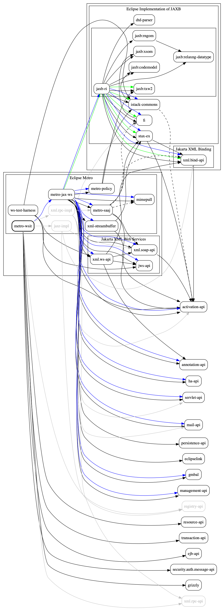

[//]: # " Copyright (c) 2019 Oracle and/or its affiliates. All rights reserved. "
[//]: # "  "
[//]: # " This program and the accompanying materials are made available under the "
[//]: # " terms of the Eclipse Distribution License v. 1.0, which is available at "
[//]: # " http://www.eclipse.org/org/documents/edl-v10.php. "
[//]: # "  "
[//]: # " SPDX-License-Identifier: BSD-3-Clause "

### Dependency graph for Metro/JAXWS/JAXB ###

* Starts from 'metro-wsit' node
* A node represents a repository (except nodes prefixed with 'jaxb:' - these are contained within jaxbri repository)
* A cluster with a label represents specific Eclipse project
* Unnamed clusters are used to keep related nodes/clusters together, ie API/IMPL
* dotted edge - optional dependency
* solid edge - compile/runtime dependency
* green edge - a dependency directly accessed through JAXB-BOM from metro-jax-ws
* blue edge - a dependency directly accessed through JAXB-BOM and/or JAXWS-BOM from metro-wsit
* grey edge/node - 'optional' dependencies as of Java EE 8/Jakarta EE 8, candidates for removal

